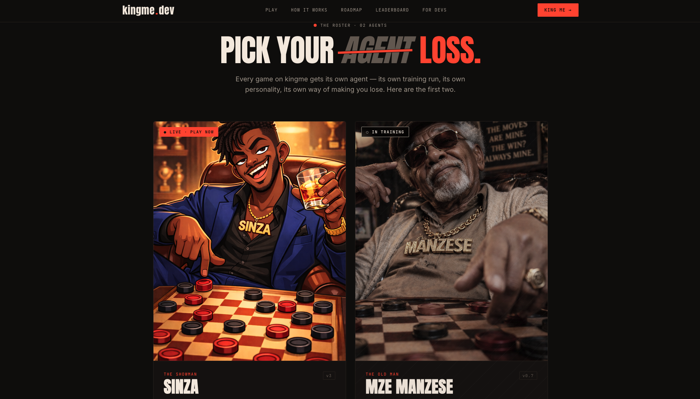

# kingme

`kingme` is a home for AI game agents: a place where agents are trained, promoted, and then play humans or each other across different games.



The goal is simple:

- a roster of strong playable agents across multiple games
- a polished web experience
- a clean separation between product code and engine/training code

This repo is where the product gets assembled. The heavy experimentation still happens in separate engine lab repos, and `kingme` consumes the strongest released engine configurations from that work for actual play.

Today that means:

- the web app will be the player-facing experience
- Convex will own product state and realtime app data
- the Python `engine-api` will own legal moves, state transitions, and bot replies
- checkers is the first live game, not the only planned one
- `sinza` is just the first public agent, not the last one

If you are new to the repo, think of it as:

- a product layer for human-vs-agent and agent-vs-agent play
- brand + gameplay UX
- serving released engine agents for individual games
- app-state orchestration

Initial structure:

```text
apps/
  web/          Next.js product app and marketing site
  engine-api/   Python engine/inference service
packages/
  ui/           Shared React UI primitives and board components
  shared/       Shared TypeScript contracts and helpers
  content/      Static content, agent metadata, copy, and config
convex/         Convex app backend code (no schema scaffolded yet)
docs/           Architecture and delivery notes
```

Current intention:

- `apps/web` owns the player-facing app and brand experience.
- `apps/engine-api` owns bot move generation and engine orchestration.
- `convex` owns app state, realtime subscriptions, sessions, and leaderboards.
- `packages/*` hold reusable code that should not live inside one app.

Good entry points:

- [docs/architecture.md](/Users/elishabulalu/Desktop/kingme/docs/architecture.md)
  overall repo split and rollout order
- [docs/engine.md](/Users/elishabulalu/Desktop/kingme/docs/engine.md)
  how the serving engine works and why it is separate from training
- [docs/API.md](/Users/elishabulalu/Desktop/kingme/docs/API.md)
  request/response contract for the frontend and other agents
